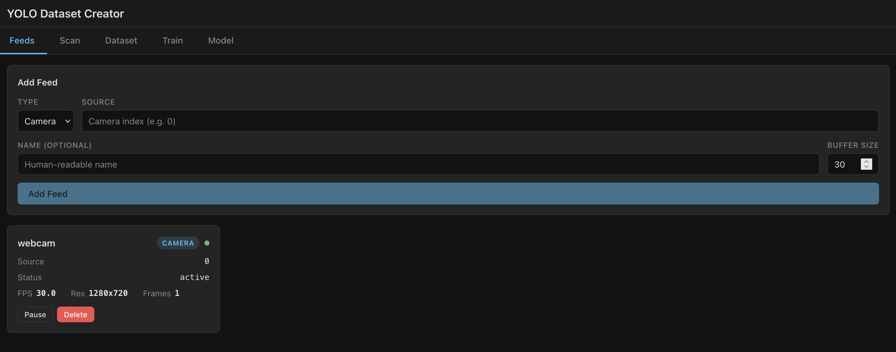
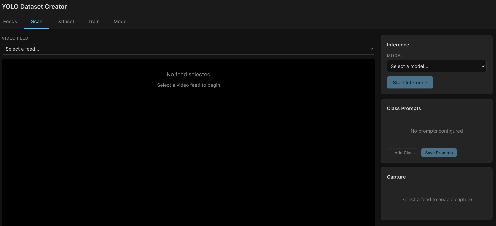
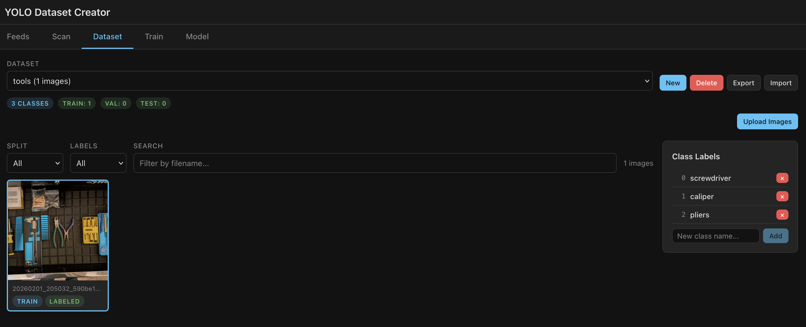
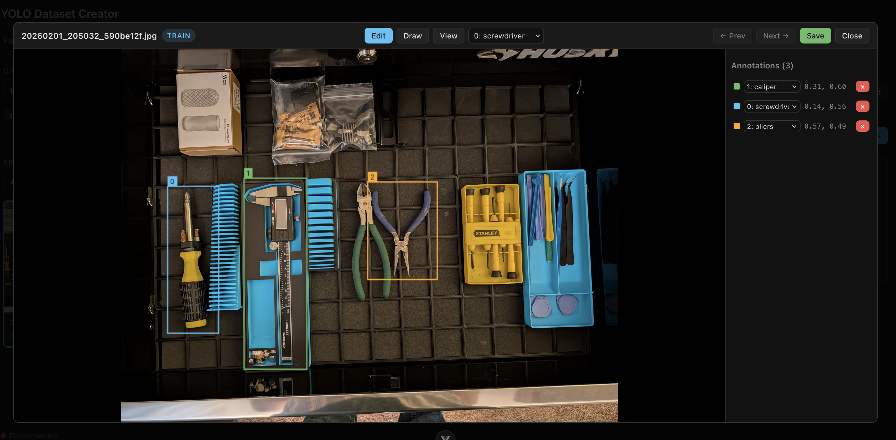
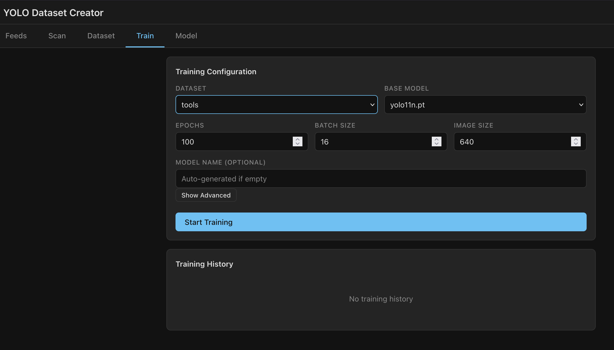
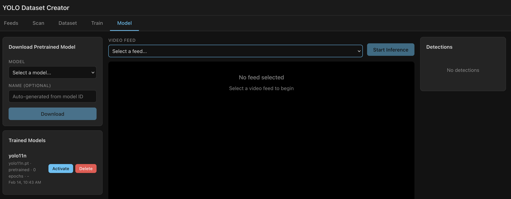

# YOLO Dataset Creator

A browser-based tool for the full object detection workflow: live video scanning with YOLO-World, automated dataset creation, model fine-tuning, and inference deployment.

> **Note:** This project was vibecoded with [Claude](https://claude.ai) and is intended for **local/personal use only**. It has not been audited for security and should not be deployed on public networks.

## Features

**Feeds** - Create feeds from local webcams. Future capability to connect to remote feeds.



**Scan and Capture** — Point a camera, describe what to detect with text prompts, and YOLO-World finds it. Frames are captured automatically or on demand, complete with auto-generated annotations.



**Dataset Editing** — Review, edit, and organize captured images and bounding boxes. Manage labels, assign train/val/test splits, import/export ZIP archives, and refine annotations before training.





**Training** — Fine-tune YOLO models on your datasets with configurable hyperparameters. Monitor training progress in real time via WebSocket updates.



**Model Eval** — Run your trained models against live feeds for inference without capture, or swap between base and fine-tuned models on the fly.



### Additional Capabilities

- Real-time WebSocket video streaming with bounding box overlays
- Dual-mode capture: raw frames or inference frames with annotations
- Centralized notification system (toast/banner alerts for all subsystem events)
- Filesystem-backed persistence with pluggable storage interfaces
- Full REST API with OpenAPI documentation at `/api/docs`

## Quick Start

### Docker (Recommended)

```bash
docker compose up
```

Open http://localhost in your browser. The frontend serves on port 80 and proxies API/WebSocket traffic to the backend automatically.

**With GPU support** (requires [nvidia-container-toolkit](https://docs.nvidia.com/datacenter/cloud-native/container-toolkit/latest/install-guide.html)):

```bash
docker compose -f docker-compose.yml -f docker-compose.gpu.yml up
```

**With the legacy Flask server** (port 5001):

```bash
docker compose --profile legacy up
```

### Local Development

Requirements: Python 3.12+, Node.js 22+

```bash
# Backend
python -m venv venv
source venv/bin/activate
pip install -r requirements.txt
uvicorn backend.main:app --reload --port 8000

# Frontend (separate terminal)
cd frontend
npm install
npm run dev
```

- Frontend: http://localhost:5173 (Vite dev server, proxies `/api` and `/ws` to backend)
- Backend API docs: http://localhost:8000/docs

### Running Tests

```bash
source venv/bin/activate
python -m pytest backend/tests/ -v
```

## Architecture

```
Browser ──HTTP/WS──▶ nginx (port 80)
                        ├── Static files (Vue SPA)
                        ├── /api/* ──▶ FastAPI (port 8000)
                        └── /ws/*  ──▶ FastAPI (WebSocket)
```

| Layer | Technology |
|-------|------------|
| Frontend | Vue.js 3 + TypeScript + Vite + Pinia |
| Backend | FastAPI + Pydantic + Uvicorn |
| ML | Ultralytics YOLO / YOLO-World |
| Video | OpenCV |
| Deployment | Docker Compose + nginx reverse proxy |

### Subsystems

The backend is organized into independent subsystems that communicate via an in-process event bus:

| Subsystem | Purpose |
|-----------|---------|
| **Feeds** | Camera/RTSP input, ring buffers, derived inference feeds |
| **Inference** | Model loading, per-frame detection, output feed production |
| **Capture** | Interval/manual frame capture with auto-annotations |
| **Dataset** | CRUD for datasets, images, labels, splits |
| **Training** | Async fine-tuning jobs with progress reporting |
| **Notifications** | WebSocket broadcast of system events |
| **Persistence** | Filesystem storage with abstract interfaces |

### Project Structure

```
yolo_dataset_creator/
├── backend/                # FastAPI backend
│   ├── main.py             # App entry, lifespan, routers
│   ├── api/                # REST API routers
│   ├── websocket/          # WebSocket endpoints
│   ├── models/             # Pydantic request/response schemas
│   ├── core/               # Config, events, exceptions
│   ├── feeds/              # Feed manager, streaming
│   ├── inference/          # Model loader, sessions
│   ├── capture/            # Capture controller
│   ├── dataset/            # Dataset manager
│   ├── training/           # Training manager
│   ├── notifications/      # Notification manager
│   ├── persistence/        # Store interfaces + filesystem impl
│   ├── Dockerfile          # Backend container image
│   └── tests/              # Unit tests (pytest)
├── frontend/               # Vue.js 3 SPA
│   ├── src/
│   │   ├── views/          # Scan, Dataset, Train, Model views
│   │   ├── stores/         # Pinia state management
│   │   ├── composables/    # useApi, useWebSocket, useVideoStream
│   │   ├── components/     # Reusable Vue components
│   │   └── types/          # TypeScript type definitions
│   ├── Dockerfile          # Multi-stage build → nginx
│   └── nginx.conf          # Reverse proxy config
├── docker-compose.yml      # Frontend + backend + legacy
├── docker-compose.gpu.yml  # NVIDIA GPU override
├── requirements.txt        # Python dependencies
├── datasets/               # Dataset storage (gitignored)
├── models/                 # Trained models (gitignored)
├── docs/                   # Architecture and guides
└── tests/                  # E2E / integration tests
```

## Documentation

### Architecture

- [Top-Level Architecture](docs/ARCHITECTURE.md) — System overview, data flows, subsystem interactions
- [Product Specification](docs/SPEC.md) — Feature requirements, modes of operation, target hardware

### Subsystem Deep Dives

- [API Gateway](docs/architecture/api-gateway.md) — REST endpoints, WebSocket handlers, capture controller
- [Feeds](docs/architecture/feeds.md) — Feed types, ring buffers, subscriptions, derived feeds
- [Inference](docs/architecture/inference.md) — Model loading, inference sessions, output feeds
- [Dataset](docs/architecture/dataset.md) — CRUD, annotations, review queue, file formats
- [Training](docs/architecture/training.md) — Training runner, model registry, hyperparameters
- [Notifications](docs/architecture/notifications.md) — Event types, WebSocket broadcast, toast/banner
- [Persistence](docs/architecture/persistence.md) — Store interfaces, filesystem implementation, DI
- [Frontend](docs/architecture/frontend.md) — Vue components, Pinia stores, composables
- [Authentication](docs/architecture/authentication.md) — Auth & RBAC (planned)

### Guides

- [Implementing a Feed](docs/guides/guide-implementing-a-feed.md)
- [Feed API Usage](docs/guides/guide-feed-api.md)
- [Notifications API](docs/guides/guide-notifications-api.md)
- [Sending Notifications](docs/guides/guide-sending-notifications.md)
- [Implementing a Storage Backend](docs/guides/guide-implementing-a-storage-backend.md)
- [Using Persistence](docs/guides/guide-using-persistence.md)

## Docker Deployment

The Docker setup uses three services:

| Service | Image | Exposed Port | Purpose |
|---------|-------|-------------|---------|
| `frontend` | nginx 1.27 | 80 | Serves Vue SPA, reverse-proxies `/api` and `/ws` to backend |
| `backend` | Python 3.12 | (internal) | FastAPI app, not exposed externally |
| `legacy` | Python 3.12 | 5001 | Original Flask server (opt-in via `--profile legacy`) |

Persistent data is stored in named Docker volumes:

| Volume | Mount Point | Contents |
|--------|------------|----------|
| `ydc-datasets` | `/app/datasets` | Image datasets and labels |
| `ydc-models` | `/app/models` | Trained model weights |
| `ydc-runs` | `/app/runs` | Ultralytics training run outputs |

All containers run as non-root users with dropped capabilities and no-new-privileges.

## Configuration

The backend uses environment variables with a `YDC_` prefix (powered by Pydantic Settings):

| Variable | Default | Description |
|----------|---------|-------------|
| `YDC_DATA_DIR` | `datasets` | Dataset storage directory |
| `YDC_MODELS_DIR` | `models` | Trained model storage directory |
| `YDC_CORS_ORIGINS` | `["http://localhost:5173"]` | Allowed CORS origins |
| `YDC_DEFAULT_MODEL_NAME` | `yolo11n` | Default YOLO model for inference |
| `YDC_TRAINING_EPOCHS` | `100` | Default training epochs |
| `YDC_FEED_STREAM_FPS` | `15.0` | WebSocket frame streaming FPS |

See [`backend/core/config.py`](backend/core/config.py) for the full list.

## Legacy Application

The original Flask-based YOLO Dataset Creator (`server.py` + `static/`) is preserved and can be run standalone or via Docker:

```bash
# Standalone
python server.py  # http://localhost:5001

# Docker
docker compose --profile legacy up
```

See [README-legacy.md](README-legacy.md) for the original documentation.

## License

MIT
